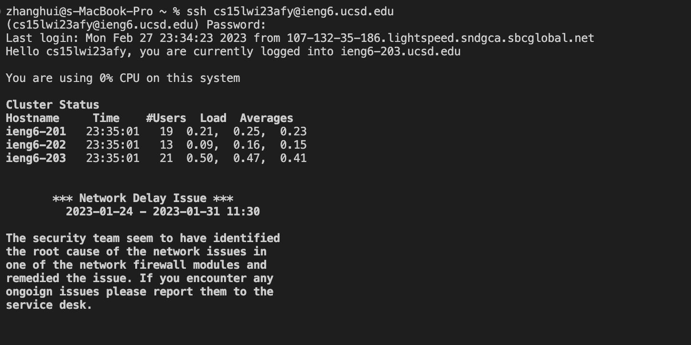
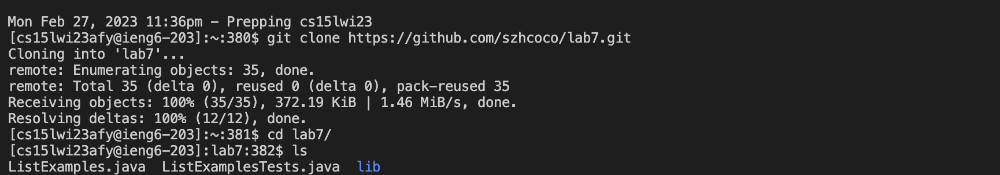
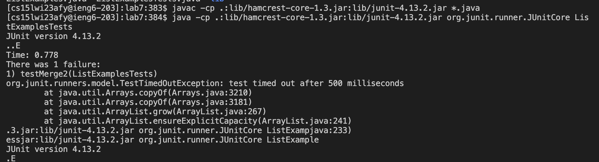
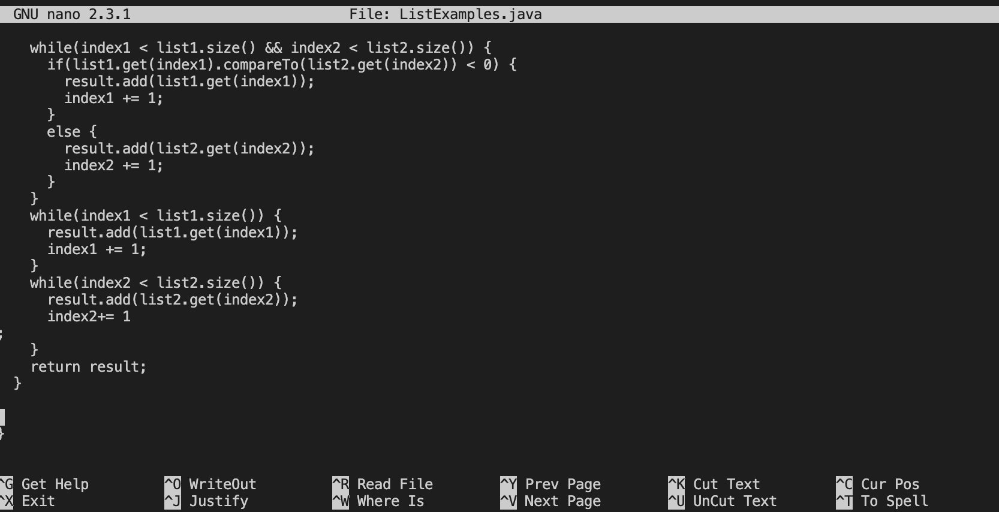
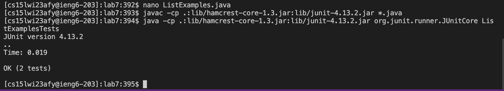

# Lab7
### step4
I logged into my account by typing out the command ```ssh cs15lwi23afy@ieng6.ucsd.edu``` and then hit the key ```<enter>```.
 

### step5
I clone the repository into my computer using ```git clone``` and also copy the link after the command. The complete command is ```git clone git@github.com:ucsd-cse15l-w23/lab7.git```, and then press ```<enter>```.


### step6
In order to compile the files in the lab7 directory, I typed ```cd lab7``` to go into the directory. 
Then I compiled the test file using ```javac -cp .:lib/hamcrest-core-1.3.jar:lib/junit-4.13.2.jar *.java```. I copied the command from lab week 3 using ```<ctrl>-C``` and pasted it in my terminala using ```<ctrl>-V```.
Then I ran the test by coping and pasting the ```java -cp .:lib/hamcrest-core-1.3.jar:lib/junit-4.13.2.jar org.junit.runner.JUnitCore ListExamplesTests```. I typed in the ```ListExamplesTests``` by pressing the first a few letters and then pressed ```<tab>```, which completed the file name. These commands showed one failed test in the file. 


### step7
I opened the window to show the code in the ```ListExamples``` file and fixed the code. The commands I pressed are 
```nano L<tab>.java```, and then hit ```<enter>``` to get the screen of codes showed up. Then I kept pressing ```<down>``` to get to the line that caused the sympton and changed it. In specific, I changed the  ```result1``` to ```result2``` by pressing the ```<delete>``` and ```<2>```. 
To exit the screen, I pressed ```<ctrl>-X```, and pressed```<Y>``` to save the changes. 
 

### step8
After fixing the tests, I compiled using ```javac -cp .:lib/hamcrest-core-1.3.jar:lib/junit-4.13.2.jar *.java```. Since I used this command before, I kept pressing ```<up>``` until it showed up, then hit ```<enter>``` to successfully compiled it. Similar process for running the test, I pressed ```<up>``` until ```java -cp .:lib/hamcrest-core-1.3.jar:lib/junit-4.13.2.jar org.junit.runner.JUnitCore ListExamplesTests``` shoed up and then hit  ```<enter>```. The terminal shoed that the test all passed. 
 

### step9
I used the following commands to commit the chanages to github:
```git add L<tab>.java``` This is used to push the changed file, and the ```<tab>``` is used complete the name of the file.
```git commit -m "updated"``` This is used to commit the changes to the github and also prints out the messages after it is done. 
 
